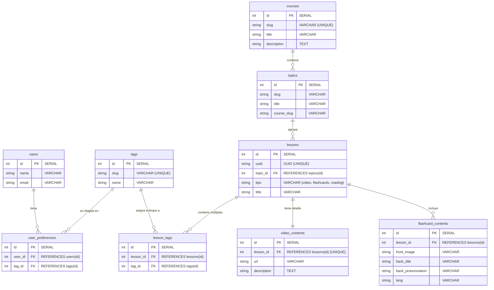

# MaltTalk
Made this new project based on my older one called "Aprende-Idiomas". This is a project based on learning various languages at no cost for the people.
# About this project
MaltTalk’s vision is to make language learning accessible to everyone, especially people who do not have access to paid education or structured learning resources.
The goal is to provide high-quality language education at no cost, using collaborative development and community-driven improvement, so anyone can learn a new language regardless of their economic situation.

## Database Design

