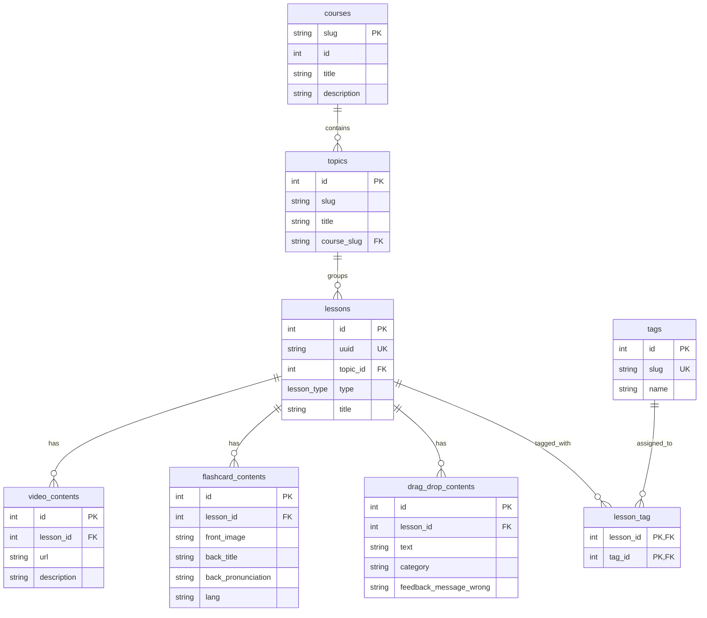

# MaltTalk

MaltTalk is a modern, database-driven language learning platform built with Next.js, Prisma, and PostgreSQL. The project aims to make language education accessible, free, and structured, while keeping the content easy to manage through a local admin interface.

## Overview

This application provides:

- a public landing experience for visitors
- a course catalog backed by the database
- a module dashboard for each course
- lesson pages for video, flashcard, and drag-and-drop content
- a local-only admin panel for creating courses, topics, lessons, and content entries

The app is designed to be friendly for local development and easy to extend with new language courses and learning activities.

## Tech Stack

- Next.js 16 (App Router)
- React 19
- TypeScript
- Tailwind CSS
- Prisma ORM
- PostgreSQL
- Docker-ready local development setup

## Project Structure

- src/app: application routes, pages, and UI components
- src/app/actions: server actions for database access
- src/app/api: REST-like API routes for admin and lesson content
- src/lib: shared infrastructure such as Prisma client setup
- prisma/schema.prisma: complete database schema

## Database Schema

The application uses a relational model centered around courses, topics, lessons, and their content types.

## Prisma Models Summary

- courses: stores the top-level course entries such as English or other languages.
- topics: groups lessons inside a course.
- lessons: represents each learning unit and supports one of three lesson types:
  - video
  - flashcards
  - drag_drop
- video_contents: stores YouTube or video URLs and descriptions.
- flashcard_contents: stores flashcard prompts and metadata.
- drag_drop_contents: stores drag-and-drop items and feedback messages.
- tags and lesson_tag: support future tagging and filtering features.

## Local Development

1. Install dependencies:
   npm install
2. Generate Prisma client:
   npx prisma generate
3. Validate schema:
   npx prisma validate
4. Start the app:
   npm run dev

## Admin Panel

The app includes a local-only admin interface at /admin for creating content directly in the database. It is intended for local development and testing, not for production authentication.

